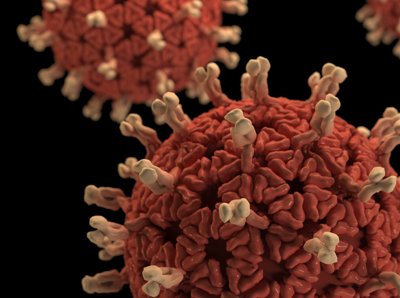

# How Computer Science can help with Covid-19 Research (Mike Collins, 4/15/2020, TDNUG)

- **Notes on How Computer Science can help with Covid-19 related topics**

## Welcome

- How's everyone doing?
- Any interesting projects or learning you want to share?
- Any thoughts on how Computer Science can help with Covid?

## General Info

- [Pluralsight Free for month of April 2020](https://www.pluralsight.com)
- [Thank you for signing up to be the first to know Microsoft Ignite event details September 2020](https://www.microsoft.com/en-us/ignite)

## Observations on How Computer Science is helping with Covid-19

- Computer Science helping with
  - Data Analytics and Visualization
  - AI assisted search - Searching large amounts of data to drill down into pertinent information
  - Remote working, learning, ordering and delivery, service availability
  - General Information - local public health sites, cdc, who, johns hopkins, weather channel

## Examples

### Dashboards

- [Johns Hopkins](https://coronavirus.jhu.edu)
- [World Health Organization](https://covid19.who.int)
- [Weather Channel](https://weather.com/coronavirus)
- [Infragistics](https://igniteui.github.io/COVID-19-Dashboard)

### Supercomputing

- [IBM Summit](https://www.ibm.com/thought-leadership/summit-supercomputer)
  As a powerful example of the potential, IBM’s Summit, the most powerful supercomputer on the planet, has already enabled researchers at the Oak Ridge National Laboratory and the University of Tennessee to screen 8,000 compounds to find those that are most likely to bind to the main “spike” protein of the coronavirus, rendering it unable to infect host cells. They were able to recommend the 77 promising small-molecule drug compounds that could now be experimentally tested. This is the power of accelerating discovery through computation.
- [Researchers enlist Summit supercomputer to combat coronavirus](https://youtu.be/IRtBKUeAly4)
- [The COVID-19 High Performance Computing Consortium](https://covid19-hpc-consortium.org)

### Guidance

- [CDC Covid-19 Guidance](https://www.cdc.gov/coronavirus/2019-nCoV/index.html)

### AI Related

- [Coronavirus - how can AI help?](https://melwy.com/blog/coronavirus-how-can-ai-help)

- [AllenAi.org](https://allenai.org)
- [Covid-19 Primer](https://covid19primer.com/dashboard)
- [COVID-19 Open Research Dataset (CORD-19)](https://pages.semanticscholar.org/coronavirus-research)
- [SIIRH2020 Keynote Talk III: CORD-19 by Kyle Lo and Lucy Lu Wang](https://youtu.be/geX4hSRW2vA)
- [CORD-19 Demos and Resources](https://discourse.cord-19.semanticscholar.org/t/cord-19-demos-and-resources/132)
- [CORD-19 Explorer](https://cord-19.apps.allenai.org)
- [CoViz - use Chrome](https://coviz.apps.allenai.org/jnlpba/)
- [Neural Covidex](https://covidex.ai/)

- [Semantic Scholar is a free, AI-powered search engine for scientific literature](http://semanticscholar.org)

- [Kaggle - Use NLP to answer key questions from the scientific literature](https://www.kaggle.com/allen-institute-for-ai/CORD-19-research-challenge/)
- [Kaggle Data Science and ML Community](https://www.kaggle.com/)
- [COVID-19 Kaggle community contributions](https://www.kaggle.com/covid-19-contributions)
- [What can you do with Kaggle](https://youtu.be/TNzDMOg_zsw)
- [Help us better understand COVID-19](https://www.kaggle.com/covid19)
  - Use NLP to answer key questions from the scientific literature 
  - Forecast COVID-19 cases and fatalities to help understand what drives transmission rates
  - Curate COVID-19 related datasets to further research
  - Use exploratory analysis to answer research questions that support frontline responders 

## .NET Project - Get Started

- [Advanced NLP processing - sketchengine](https://app.sketchengine.eu/#dashboard?corpname=preloaded%2Fcovid19)
- [Natural Language Processing in ML.NET: Producing N-Grams](https://youtu.be/dOrRM6RN8jM?list=PLl_upHIj19Zy3o09oICOutbNfXj332czx)

## Resources

- [ML.NET End-to-End Playlist](https://www.youtube.com/playlist?list=PLl_upHIj19ZxKToVL3vVfHOuGCilx0eMK)
  - 3 ML.NET end to end videos
- [ML.NET Playlist - Jon Woods Wintellect](https://www.youtube.com/watch?v=8gVhJKszzzI&list=PLl_upHIj19Zy3o09oICOutbNfXj332czx)
  - 38 short videos on ML.NET
  - For CORD-19 Natural Language Processing, see NLP entries in this list
- [ML.NET Samples](https://github.com/dotnet/machinelearning-samples)
- [ML.NET Sample Jeff Prosise](https://github.com/jeffprosise/ML.NET)
- [COVID - 19 Outbreak Prediction using Machine Learning | Machine Learning Training | Edureka](https://youtu.be/_Hi6_JQesSQ)
- [The next outbreak? We’re not ready | Bill Gates - YouTube](https://www.youtube.com/watch?v=6Af6b_wyiwI)
- [Analyzing COVID-19: Can the Data Community Help? Mar 19, 2020](https://www.youtube.com/watch?v=A0uBdY4Crlg)
- [Screencast: Cleaning and exploring the COVID-19 Open Research Dataset (CORD-19) R](https://www.youtube.com/watch?v=-5HYdBq_PTM)
- [Screencast: Creating an R data package (cord19) in RStudio](https://www.youtube.com/watch?v=F4oUJp76KUY)
- [SavantX PRO CORD 19 Explainer Video](https://www.youtube.com/watch?v=KdPVGjjatFU)

- [IBM / Orielly Learn AI April 16, 2020, 9am ET](https://ibm-learnai.bemyapp.com/?utm_campaign=CORD-19&utm_source=hs_email&utm_medium=email&utm_content=86154985&_hsenc=p2ANqtz-8ToSAdMLDkSqO8jczHvQXNSqlmmwlfPZBKinhiLsUPCHRsjPnxsunynbML9RCz7TlhxMLyk1VZ61caMSir2q4PwkcWKw&_hsmi=86154985)
- [CORD-19: Filtering the Dataset and Generating Abstracts](https://community.ibm.com/community/user/datascience/blogs/nick-acosta1/2020/04/02/cord-19-preprocessing-the-dataset-and-preparing-fo)
- [A BERT model for scientific text github](https://github.com/allenai/scibert)
- [A BERT model for scientific text paper](https://arxiv.org/abs/1903.10676)

## Datasets and sample projects

- [Kaggle Datasets](https://www.kaggle.com/covid-19-contributions#Hypertension)
- [COVID-19 Open Research Dataset (CORD-19)](https://pages.semanticscholar.org/coronavirus-research)
- [2019 Novel Coronavirus COVID-19 (2019-nCoV) Data Repository by Johns Hopkins CSSE](https://github.com/CSSEGISandData/COVID-19)
- [NYT - Coronavirus (Covid-19) Data in the United States](https://github.com/nytimes/covid-19-data)
- [Process New York Times Covid-19 Dataset](https://towardsdatascience.com/analyze-ny-times-covid-19-dataset-86c802164210)
  - Creating a simple Python class to analyze and visualize the Covid-19 dataset from the New York Times
- [How to Create an Angular Covid-19 Dashboard in Hours](https://www.infragistics.com/community/blogs/b/infragistics/posts/create-covid_2d00_19-dashboard)
  - infragistics igniteui and tools
- [How to create a Coronavirus (COVID-19) Dashboard & Map App in React with Gatsby and Leaflet](https://www.freecodecamp.org/news/how-to-create-a-coronavirus-covid-19-dashboard-map-app-in-react-with-gatsby-and-leaflet)
- [Cool idea - abstract grouping Corid-19](https://towardsdatascience.com/how-to-get-started-analyzing-covid-19-data-808822437c32)

## More Resources

- [Knowledge Graph of COVID-19 Literature](https://ds-covid19.res.ibm.com/about)
- [Call for Code](https://developer.ibm.com/callforcode)
- [Create a machine learning powered web app to answer questions](https://github.com/IBM/MAX-Question-Answering-Web-App/blob/master/README.md)
- [Microsoft Academic - Research more, search less](https://academic.microsoft.com/home)
- [Examples for utilizing Microsoft Academic for conducting covid-19 research](https://github.com/microsoft/mag-covid19-research-examples)
- [Microsoft Academic - Covid](https://academic.microsoft.com/search?q=coronavirus%20disease%202019&qe=%40%40%40Composite(F.FN%3D%3D%27coronavirus%20disease%202019%27)&f=&orderBy=0&skip=0&take=10)
- [Azure Covid-19 Search - Updated Apr-12-2020 (59655 total articles)](https://covid19search.azurewebsites.net/home)
- [7 Predictions for a Post-Coronavirus World](https://marker.medium.com/7-predictions-for-a-post-coronavirus-world-aaac052c8514)
- [ML | Natural Language Processing using Deep Learning](https://www.geeksforgeeks.org/ml-natural-language-processing-using-deep-learning/)
- [what can computer science do to help with covid-19](https://www.bing.com/search?q=what+can+computer+science+do+to+help+with+covid-19&form=EDNTHB&mkt=en-us&httpsmsn=1&msnews=1&rec_search=1&plvar=0&refig=fce5838e3f934982883f53184cc00e44&PC=LCTS)
- [Coronavirus – What we’re doing and how you can help](https://foldingathome.org/covid19)
- [Latest Application Updates Feedback and Suggestions Data provided by Semantic Scholar ](https://www.kaggle.com/paultimothymooney/most-common-words-in-the-cord-19-dataset)
- [COVID-19: Google And Apple Reveal More Intriguing Details Of Contact-Tracing](https://www.forbes.com/sites/forbes-personal-shopper/2020/04/13/5-of-the-best-2-in-1-laptops/#560674d526c4)
- [Simulation](http://covidsim.eu)
- [Crimson Contagion](https://en.wikipedia.org/wiki/Crimson_Contagion)
  - Crimson Contagion was a simulation administered by the Department of Health and Human Services from January to August 2019 that tested the capacity of the U.S. federal government and twelve U.S. states to respond to a severe influenza pandemic originating in China. The exercise involves a scenario in which tourists returning from China spread a respiratory virus in the United States, beginning in Chicago. In less than two months the virus had infected 110 million Americans, killing more than half a million. The report issued at the conclusion of the exercise outlines the government's limited capacity to respond to a pandemic, with federal agencies lacking the funds, coordination, and resources to facilitate an effective response to the virus.[1][2]
- [Simulating an Epidemic](https://youtu.be/gxAaO2rsdIs)

